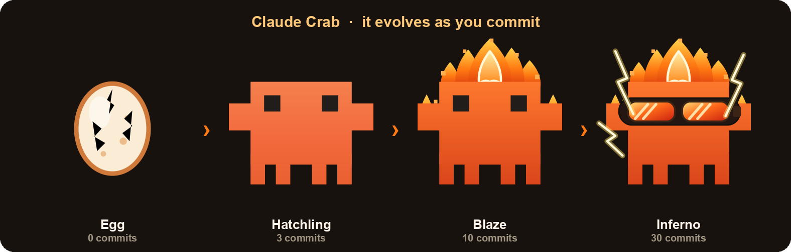

# 🦀 Claude Crab

Claude Crab is a tiny desktop pet that lives on your screen and grows as you commit code. It starts life as an egg, hatches into a baby crab, and evolves into a fiery, goggle wearing inferno. Every commit you make feeds it and pushes it toward its next form.

It is built with [Electron](https://www.electronjs.org/) and runs on **macOS and Windows** from a single codebase.



## What it does

- Sits on your desktop as a small, always on top, draggable pixel crab.
- Counts the commits you author, either from your GitHub account or from local git repositories, your choice.
- Evolves through four stages as your commit count climbs, from a cracking egg to a fiery inferno.
- Shows a little stats bubble on hover: your commit count, today and this week totals, progress to the next stage, and lifetime numbers.
- Lives quietly in your menu bar (macOS) or system tray (Windows) with quick actions to refresh, reset to an egg, or edit your settings.

## How commit counting works

You choose one of two tracking modes on first run. Your crab's stage is always based on how many commits you have made **since you adopted it**, not your all time history.

### GitHub mode

Sign in once with GitHub and the crab counts the commits you push to GitHub, across all your machines. It signs in using the [OAuth Device Flow](https://docs.github.com/apps/oauth-apps/building-oauth-apps/authorizing-oauth-apps#device-flow): the app shows a short code, you enter it at github.com/login/device in your browser, and approve. No password and no client secret are ever handled by the app. Private-repo commits are included (the app asks for read access at sign-in), and the token is stored encrypted on your machine. Only commits pushed to GitHub are counted.

### Local mode

The crab counts commits on this machine, with no network and no login at all:

1. It scans the folder you choose (your home folder by default) for git repositories.
2. For each repository it runs `git rev-list --count --author <your-email>` to count the commits you authored.

Your email is used only as a local `git --author` filter and never leaves your device. The whole scanner is one short file if you want to read it: [`tracker.js`](tracker.js). Local mode also counts commits you have not pushed anywhere, and works with non-GitHub repositories.

## First run

The first time you launch the app, a short setup window appears where you pick your tracking mode:

- **GitHub**: click **Connect GitHub**, enter the shown code at github.com/login/device, and approve.
- **Local folders**: confirm your git email (auto-detected from `git config user.email`, and you can add more than one) and, optionally, pick a specific folder to watch instead of your home folder.

You also pick an evolution pace (Chill, Normal, or Grind), with an Advanced option to set exact per-stage commit thresholds. Your answers are saved to the app's per-user config in the operating system's `userData` folder, not into this repository. You can reopen your settings anytime from the tray or menu bar crab under **Edit settings**.

## Evolution stages

| Stage | Commits since adoption |
| --- | --- |
| 🥚 Egg | 0 (cracks at 2, hatches at 3) |
| 🦀 Hatchling | 3 |
| 🔥 Blaze | 10 |
| 🔥 Inferno | 30 |

The thresholds live in [`config.json`](config.json), so you can tune the whole ladder to your own pace.

## Run it locally

```bash
npm install
npm start
```

## Configuration

- [`config.json`](config.json) holds the shipped **defaults**: the evolution ladder, scan depth, and poll interval. It contains no personal data.
- Your personal settings (your emails and watched folder) are written on first run to the operating system's `userData` folder. See [`config.example.json`](config.example.json) for the shape of that file.

## Privacy

Everything stays on your device. Claude Crab has no backend and sends your data to no one. In Local mode it makes no network requests at all. In GitHub mode it talks only to GitHub, to read your own commit counts, and keeps the sign-in token encrypted on your machine. There are no accounts and no analytics.

## License

[MIT](LICENSE)
